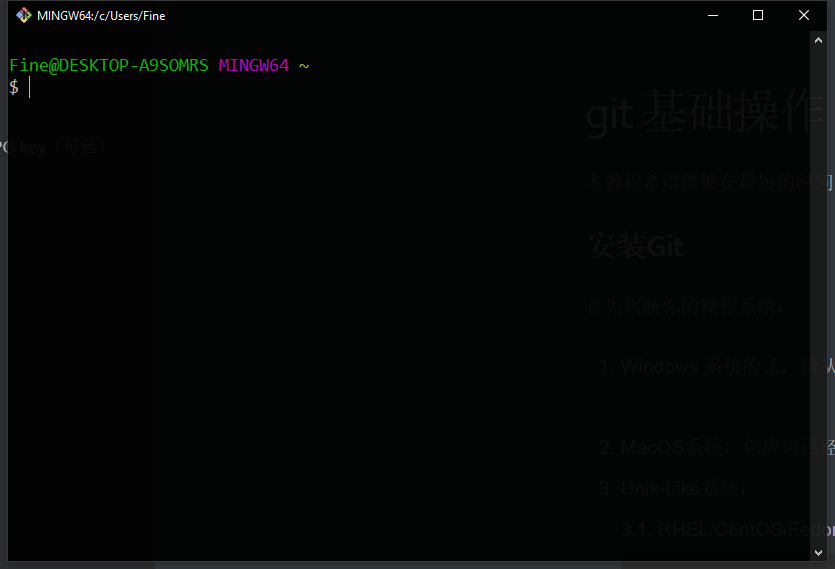
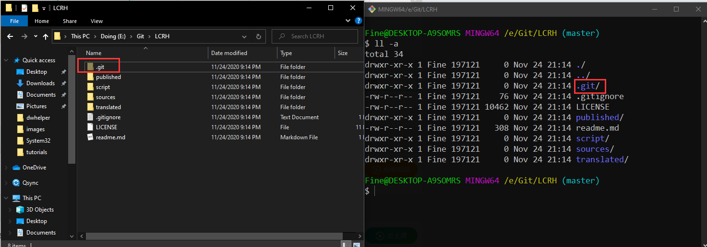
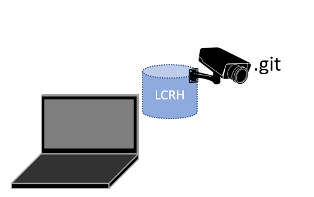
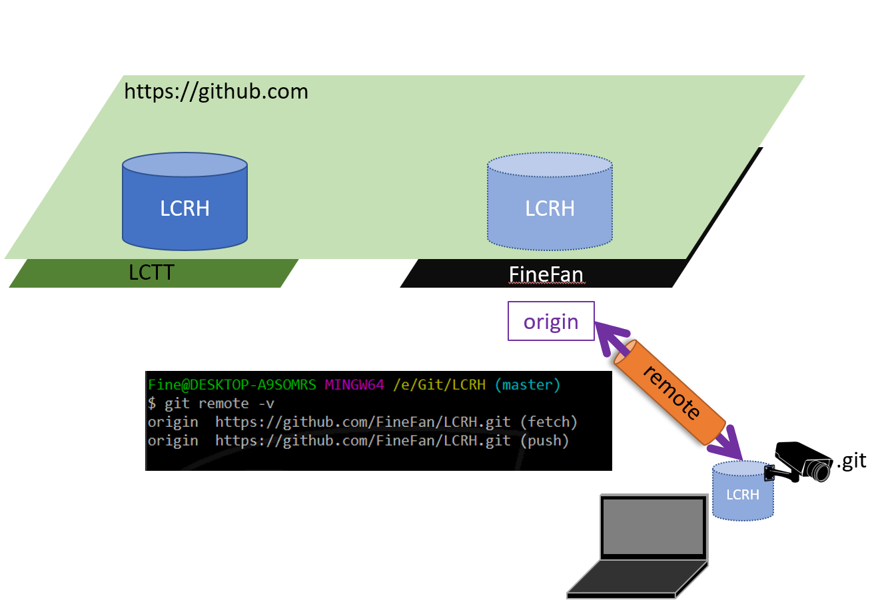
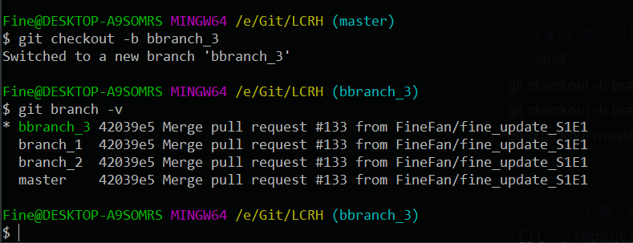
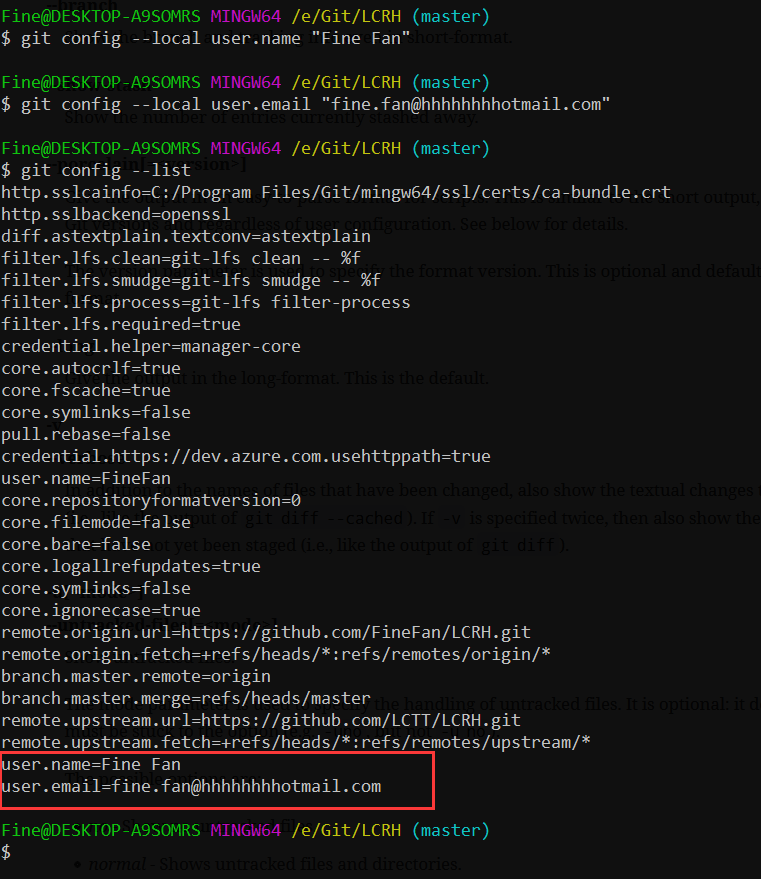
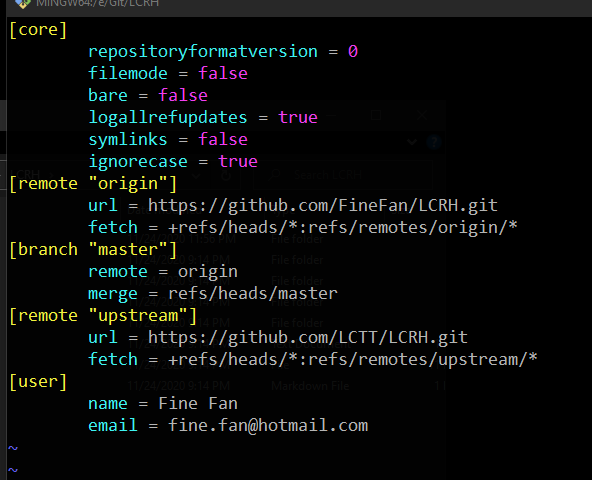
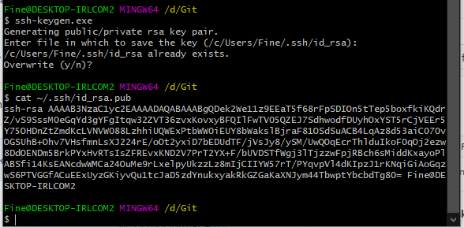

# git 基础操作

本教程希望能够在最短的时间内帮助你完成git的设置，开启你的翻译贡献之旅。

## 安装Git

首先判断你的操作系统：

1. Windows 系统的话，请从[官网下载](https://gitforwindows.org/) ,并根据界面进行下一步下一步的安装。相关选项采取默认值就好。完成安装之后，系统上会多出类似这样的应用程序。


打开之后会可以看到Git Bash的默认页面。


2. MacOS系统，应该已经自带了git的程序。

3. Unix-Like系统：

   3.1.  RPM-based distribution, such as RHEL or CentOS)

   ```SHELL
   # For CentOS 6  or  RHEL 6
   yum -y install git
   # For CentOS 7 or RHEL 7  or Fedora 32+
   dnf -y install git
   ```
	3.2.  Debian-based distribution, such as Ubuntu
   
```shell
   apt install git-all
```
> 更多 git 概念及技能请参考 [Pro Git](https://git-scm.com/book/zh/v2)。

## 创建Fork
简单来说就是把你要翻译发linux.cn的相关库，在github上面复制一份，到你的主页里面。
这里我们拿[LCTT/LCRH](https://github.com/LCTT/LCRH)来举例:
1. 登录[github](https://github.com)，然后打开[LCTT/LCRH](https://github.com/LCTT/LCRH)页面
2. 点击页面中，右上角的Fork将LCTT账号相面的LCRH 库，复制到 自己的账号下一份。


如果你和我一样必须需要一个辅助的图片来帮助记录这些概念。请参考下面的图片


## 克隆Forked 的仓库到你的本地。
在完成了仓库的Fork 之后，就可以将对应的仓库克隆到你的本地了

如上图首先请确认，当前打开的页面确实是你个人账户的页面。之后点开那个绿色的Code按钮，在弹出的下拉菜单中选择HTTPS协议（我这边SSH不好使）之后点击后面的 复制按钮。将相关的连接复制到你的粘贴板上。

打开Git Bash 或者其他终端，建立一个名字叫做Git的文件夹便于管理。之后执行如下命令
```shell
git clone https://github.com/FineFan/LCRH.git
```


之后就可以进入到该目录下面进行相关的配置和查看相关的信息了。


## 查看相关配置，理解相关概念。
首先让我们进入到刚刚clone下来的LCRH目录下，然后查看一下当前目录中有什么文件。


这里我唯一想说的是隐藏的**.git**目录，该目录对于整个目录来说非常重要，因为他记录了当前目录下的相关配置。如果说我们是复制过来了整个仓库的话，那么.git就类似于仓库管理员住的小房子，里面记录着你从哪里复制过来的仓库，以及仓库中已经有的东西，和之前的一些变更记录等等。



### Remote 的概念

有几个是我们需要在GitHub的PR 模式中使用到的，先来接受Rmote的概念。

在你完成 git clone之后，他会创建一些默认的配置，其中一个就是Remote，简单来说就是说明你当前的仓库是从哪里来的。

默认的远端 就叫做  **origin **

当进入到clone 好的仓库中后，可以使用 如下命令进行查看。

```shell
git remote -v
origin  https://github.com/FineFan/LCRH.git (fetch)
origin  https://github.com/FineFan/LCRH.git (push)
```

如下图所示他会针对origin这个仓库返回两个条目 ，注意最后括号里面的内容 

1. (fetch)  取货，往下抓代码
2. (push)  推送，向上推送代码。




按照LCTT的仓库设置PR的模式进行相关的翻译工作的话，我们这就需要添加一个remote 指向LCTT的 LCRH仓库，方便日后更新同步。

做法也简单，先找到上游仓库的地址。


然后在终端输入如下命令

```shell
git remote add upstream https://github.com/LCTT/LCRH.git
```
其中upstream 就是我们自己起的名字，换成其他字符串也可以，但是习惯做法是把上游的库都写成upstream。


图示如下，虽然针对 upstream的remote配置也有两条，但是由于权限设置问题，我们只能 往下抓代码，所以图中的箭头是单向的。


### 分支

当我们默认clone完成之后，我们得到了一堆文件。他们不仅仅是摆放在那里就完事了的。他们会被默认放到一个叫做master的分支当中，我更愿意把它想象成一个大树的树干。当我们进行编写代码（翻译）的时候往往会有很多的想法，我们可以把不同的想法，用分支 branch来进行管理。


下面要讨论的就是 分支的 增、删、改、查、切换了。

* 分支的查看：
要如何查看我当前的目录下有哪些分支？ 

```shell
git branch -v
```
如果你刚刚完成git clone的话默认情况下应该只有master分支。
使用Windows上面的git bash的话会在命令提示符上面就有显示当前的分支名称。
在git branch -v 的输入中也能够看到前面带有星号的 就是目录树所在的分支快照。


是的我偷偷创建了两个新的分支branch_1 branch_2 然后在切换到 master分支来做演示。

如果你也想这样做的话可以输入下面的命令

* 分支的 增、切换：
```shell
git checkout -b branch_1
git checkout -b branch_1
git checkout master
```

分支之间的切换 很简单，就是使用 git checkout  <分支名称> 即可。

上图中可以看出，我当前的分支是master，然后切换到了 branch_1，之后又切换回了master分支。

* 分支的 改：
其实就是改个分支名称。
如果手抖，分支名称写错了。
比如下图，我是想创建 branch_3的 结果 手抖，多按了一个b就成了 bbranch_3


使用下面的命令可以让 bbranch_3  变成 branch_3

```shell
git branch -m bbranch_3  branch_3
```


* 分支的 删：
好吧玩的差不多了，在我们进行下面的操作之前，先让我们删除我们用来练习的 branch_1  branch_2  branch_3:
```shell
git checkout master #首先切换回  master分支
git branch -d branch_1 # 删除分支 branch_1
git branch -d branch_3 # 删除分支 branch_2
git branch -d branch_2 # 删除分支 branch_3
```


## 用户名 、 邮箱、 SSK Key 的配置
### 用户信息

使用 git 前需要先配置用户名及邮箱等基础信息，示例如下。

```
cd LCRH
git config --local user.name "Fine Fan"
git config --local user.email "fine.fan@hotmail.com"
```
完成之后可以通过如下命令查看一下

```shell
git config --list
```


可以通过上面的图片你可以看出，我的粗手指导致的我邮箱写错了，别担心，这里是都可以进行修改的。
可以通过 修改 如下文件保存退出后完成相关的配置修改。

```shell
vim ./git/config  # 抱歉，我这里不提供vim的相关教程。
```


修改完成之后保存退出，再次使用 git config --list 可以看到我带邮箱已经被修改回来了。


### SSH key 或者 GPG key（可选）

请参考 [GitHub SSH 帮助页面](https://help.github.com/en/articles/connecting-to-github-with-ssh)进行设置 ssh key，这样可以在每次 push 时免除输入密码。


GPG 可进行加密及数字签名，请参考 [GitHub GPG key 帮助页面](https://help.github.com/en/articles/managing-commit-signature-verification)进行设置。

简单来说就是执行ssh-keygen之后一通回车，然后吧 ~/.ssh/id_rsa.pub里面一大串内容复制到GitHub中的 个人设置里面的SSH Key里面就好了。这样Git Hub 就有了你的SSH公钥了。	



```shell
ssh-keygen  # 之后一通回车 （严格来说其实人家有好多设置的，这为了新手方便就一通回车了。）

cat ~/.ssh/id_rsa.pub 

```
之后就可以把里面的字符串 复制到github上面的个人设置里面了


## Stage 和 Working Directory

```shell

#TBD  Fine Fan 20201125- 00:00:00
```


## 基础配置


## clone 仓库

在<ruby>复刻<rt>fork</rt></ruby> [LCTT/TranslateProject](https://github.com/LCTT/TranslateProject) <ruby>仓库<rt>repository</rt></ruby>后，将自己的仓库 clone 至本地。

```
git clone git@github.com:$YOUR_GITHUB_ID/TranslateProject.git
```

如果 clone 速度比较慢可添加 `--depth N` 参数进行<ruby>浅层克隆<rt>shallow clone</rt></ruby>，N 表示仅保留最新的 N 次 commit。如：

```
git clone --depth 1 git@github.com:$YOUR_GITHUB_ID/TranslateProject.git
```

这样会把仅包含最后一次提交的完整文件列表 clone 下来，如果需要所有的 commit，可以到项目目录中执行 `git fetch --unshallow` 获取。

## 分支操作

一般来说只需要在默认的 master 分支上开始翻译即可。<ruby>分支<rt>branch</rt></ruby>是 git 最核心的设计之一，灵活且强大，如果你需要使用分支，可以参考以下建议。

基于当前状态创建一个名为 `my_branch` 的新分支：

```
git checkout -b my_branch
```

也可以基于某个 commit 创建（`$COMMIT_ID` 可以是一个 commit ID，远程分支名或任意有效<ruby><rt>符号标识</rt>symblolic identifier</ruby>）：

```
git checkout -b my_branch $COMMIT_ID
```

切换至某分支可使用 `git checkout some_branch`，切换回上次所在的分支可使用 `git checkout -`。更多分支操作请参考 `git help branch`，`git help remote` 及 `git help checkout`。

## 提交变更

当你认为工作进度应该阶段性保存时应该进行<ruby>提交<rt>commit</rt></ruby>，提交后会将你的变更存入本在 git 数据库。首先检查当前的变更是否满意，满意的话用 `git add xxx` 添加修改的文件，然后进行提交。

```
git commit
```

运行这个命令后会打开一个默认的编辑器让你填写这次变更的概要信息。一般只填写第一行标题就可以，如果标题不足以描述清楚此次变更，请隔一个空行后描述变更的正文。有兴趣可以了解 [How to Write a Git Commit Message](https://chris.beams.io/posts/git-commit/)。

你也可以使用 `git commit -m "my commit message"` 编写提交信息，如果你对自己的操作足够自信的话。不过还是推荐使用在编辑器中编辑 commit message，这种方式相对更稳妥一些。你可以使用 `git config --global core.editor $YOUR_EDITOR` 来设置一个你熟悉的编辑器作为 git 默认的编辑器。

有时有必要修改提交信息，比如可以使用 `git commit --amend` 来修改上次提交信息，可以修改的地方很多，包括用户名，邮箱，时间等，更多信息请参考 `git help commit`。

## 推送到远程

前面所提及操作的影响范围都仅限于本地，当你认为本地的状态已满意，可以<ruby>推送<rt>push</rt></ruby>到远程以发便起<ruby>拉取请求（PR）<rt>pull request</rt></ruby>将你的贡献合并到<ruby>上游<rt>upstream</rt></ruby>仓库。

```
git push
```

当你在 master 分支上工作时，这条简单的命令就够用了。当你在某个分支上工作时，需要注意向<ruby>远程分支<rt>remote branch</rt></ruby> 推送时要指定目标分支：

```
git push origin my_branch
```

## 其它

以下命令完整帮助信息请使用 `git help command` 获取。

### `git status`

这应该是你用的最多的一条 git 命令，也是最没有危险的一条命令。它会显示工作区的当前状态，可以给你很多提示。

### `git log`

查看提交历史，该命令有超多选项及选项组合。

### `git show`

查看上次提交信息，可以指定某些 commit 及任意有效标识符。

### `git diff`

该命令可以在任意两种状态或 commit 之间进行差异对比，可以通过 `git config --global diff.tool $BETTER_DIFF_TOOL` 来设置一个更专业的 diff 工具，然后用 `git difftool` 来查看并修改差异信息。

### `git fetch`

获取远程更新，但并不将远程更新合并到本地。

### `git pull`

获取远程更新并将远程更新合并到本地。
