# git 基础操作

本教程希望能够在最短的时间内帮助你完成git的设置，开启你的翻译贡献之旅。

## 安装Git

首先判断你的操作系统：

1. Windows 系统的话，请从[官网下载](https://gitforwindows.org/) ,并根据界面进行下一步下一步的安装。相关选项采取默认值就好。完成安装之后，系统上会多出类似这样的应用程序。

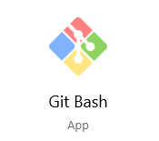

打开之后会可以看到Git Bash的默认页面。


2. MacOS系统，应该已经自带了git的程序。

3. Unix-Like系统：

   3.1.  RPM-based distribution, such as RHEL or CentOS)

   ```SHELL
   # For CentOS 6  or  RHEL 6
   yum -y install git
   # For CentOS 7 or RHEL 7  or Fedora 32+
   dnf -y install git
   ```
	3.2.  Debian-based distribution, such as Ubuntu
   
```shell
   apt install git-all
```
> 更多 git 概念及技能请参考 [Pro Git](https://git-scm.com/book/zh/v2)。

## 创建Fork
简单来说就是把你要翻译发linux.cn的相关库，在github上面复制一份到你的主页里面。
这里我们拿[LCTT/LCRH](https://github.com/LCTT/LCRH)来举例:

1. 登录[github](https://github.com)，然后打开[LCTT/LCRH](https://github.com/LCTT/LCRH)页面
2. 点击页面中，右上角的Fork将LCTT账号相面的LCRH 库，复制到 自己的账号下一份。
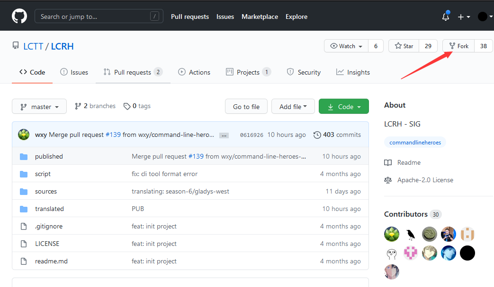

如果你和我一样必须需要一个辅助的图片来帮助记录这些概念。请参考下面的图片


## 克隆Forked 的仓库到你的本地。
在完成了仓库的Fork 之后，就可以将对应的仓库克隆到你的本地了
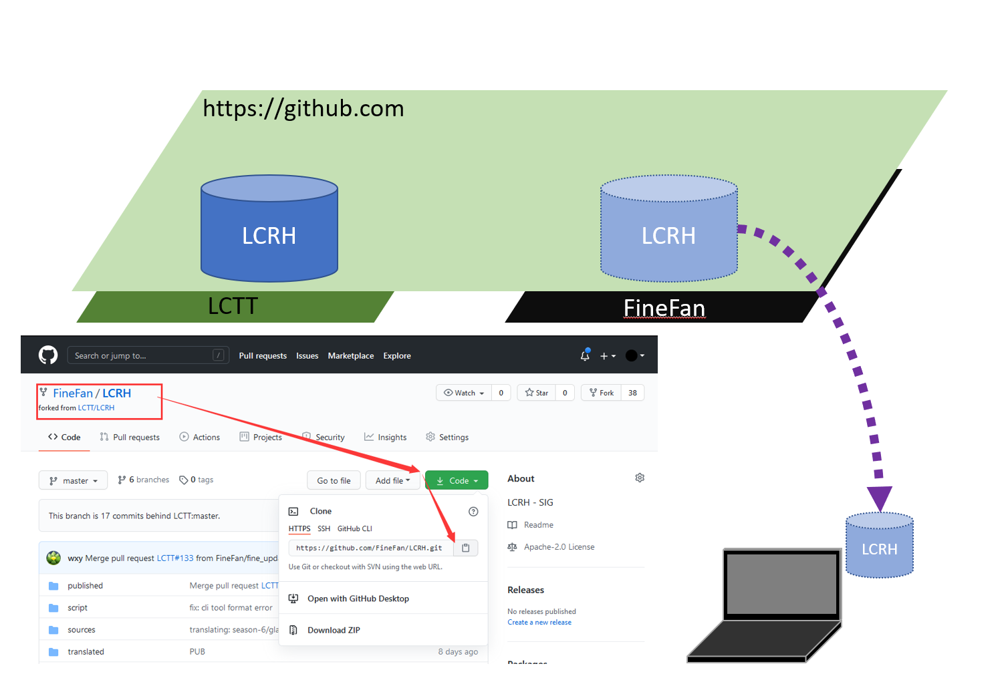
如上图首先请确认，当前打开的页面确实是你个人账户的页面。之后点开那个绿色的Code按钮，在弹出的下拉菜单中选择HTTPS协议（我这边SSH不好使）之后点击后面的 复制按钮。将相关的连接复制到你的粘贴板上。

打开Git Bash 或者其他终端，建立一个名字叫做Git的文件夹便于管理。之后执行如下命令
```shell
git clone https://github.com/FineFan/LCRH.git
```
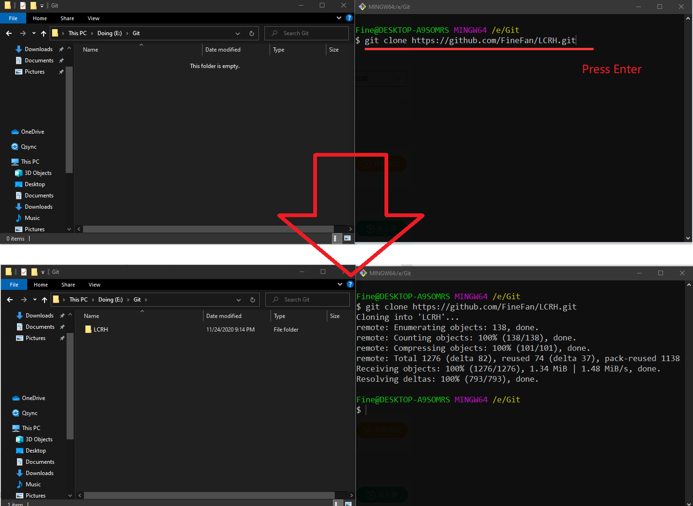

之后就可以进入到该目录下面进行相关的配置和查看相关的信息了。


## 查看相关配置，理解相关概念。
首先让我们进入到刚刚clone下来的LCRH目录下，然后查看一下当前目录中有什么文件。


这里我唯一想说的是隐藏的**.git**目录，该目录对于整个目录来说非常重要，因为他记录了当前目录下的相关配置。如果说我们是复制过来了整个仓库的话，那么.git就类似于仓库管理员住的小房子，里面记录着你从哪里复制过来的仓库，以及仓库中已经有的东西，和之前的一些变更记录等等。


### Remote 的概念

有几个是我们需要在GitHub的PR 模式中使用到的，先来讲Rmote的概念。

在你完成 git clone之后，他会创建一些默认的配置，其中一个就是Remote，简单来说就是说明你当前的仓库是从哪里来的。

默认的远端（remote） 就叫做  **origin **

当进入到clone 好的仓库中后，可以使用 如下命令进行查看。

```shell
git remote -v
origin  https://github.com/FineFan/LCRH.git (fetch)
origin  https://github.com/FineFan/LCRH.git (push)
```

如下图所示他会针对origin这个仓库返回两个条目 ，注意最后括号里面的内容 

1. (fetch)  取货，往下抓代码
2. (push)  推送，向上推送代码。


按照LCTT的仓库设置PR的模式进行相关的翻译工作的话，我们这就需要添加一个remote 指向LCTT的 LCRH仓库，方便日后更新同步。

做法也简单，先找到上游仓库的地址。

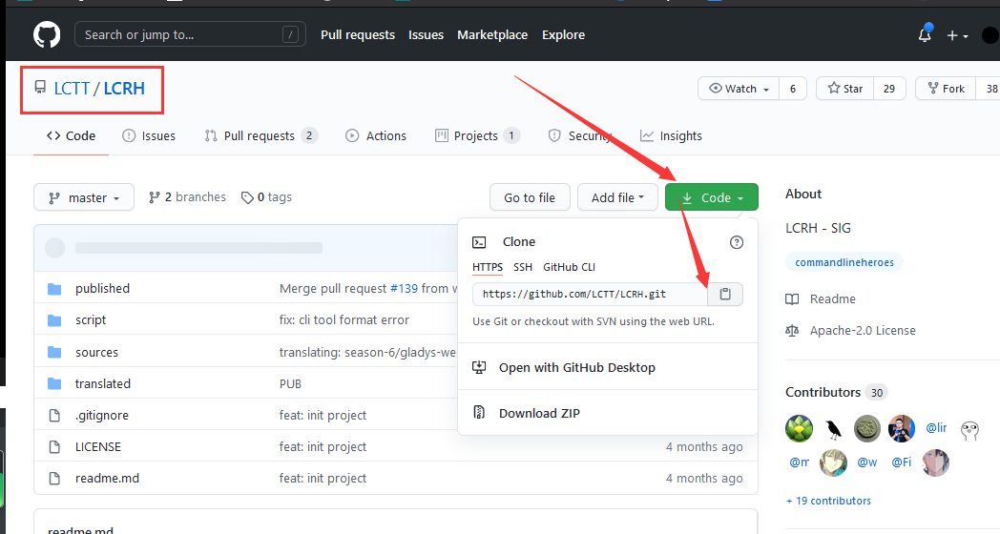

然后在终端输入如下命令

```shell
git remote add upstream https://github.com/LCTT/LCRH.git
```
其中upstream 就是我们自己起的名字，换成其他字符串也可以，但是习惯做法是把上游的库都写成upstream。


图示如下，虽然针对 upstream的remote配置也有两条，但是由于权限设置问题，我们只能 往下抓代码，所以图中的箭头是单向的。

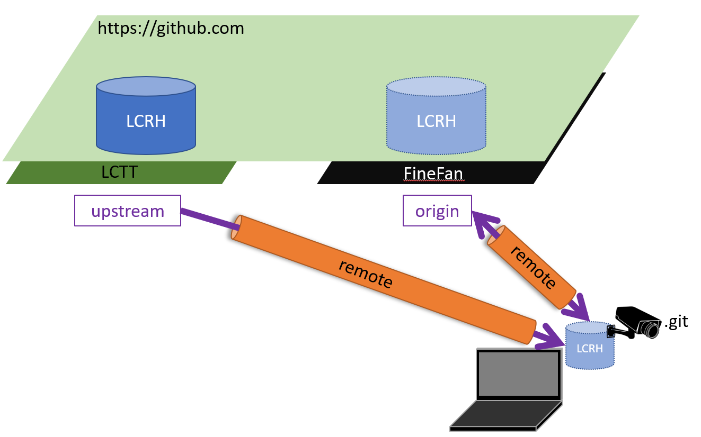

### 分支

当我们默认clone完成之后，我们得到了一堆文件。他们不仅仅是摆放在那里就完事了的。他们会被默认放到一个叫做master的分支当中，我更愿意把它想象成一个大树的树干。当我们进行编写代码（翻译）的时候往往会有很多的想法，我们可以把不同的想法，用分支 branch来进行管理。


下面要讨论的就是 分支的 增、删、改、查、切换了。

* 分支的查看：
要如何查看我当前的目录下有哪些分支？ 

```shell
git branch -v
```
如果你刚刚完成git clone的话默认情况下应该只有master分支。
使用Windows上面的git bash的话会在命令提示符上面就有显示当前的分支名称。
有些命令行终端默认没有配置git分支的显示，此时我们就可以使用git branch -v ，在输出中也能够看到。

前面带有星号的 就是目录树所在的分支快照。


是的我偷偷创建了两个新的分支branch_1 branch_2 然后在切换到 master分支来做演示。

如果你也想这样做的话可以输入下面的命令

* 分支的 增、切换：
```shell
git checkout -b branch_1
git checkout -b branch_1
git checkout master
```

分支之间的切换 很简单，就是使用 git checkout  <分支名称> 即可。
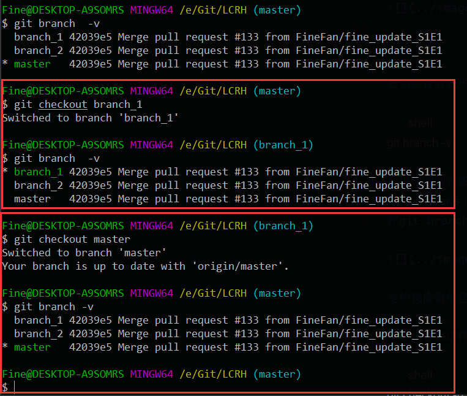
上图中可以看出，我当前的分支是master，然后切换到了 branch_1，之后又切换回了master分支。

* 分支的 改：
其实就是改个分支名称。
如果手抖，分支名称写错了。
比如下图，我是想创建 branch_3的 结果 手抖，多按了一个b就成了 bbranch_3


使用下面的命令可以让 bbranch_3  变成 branch_3

```shell
git branch -m bbranch_3  branch_3
```
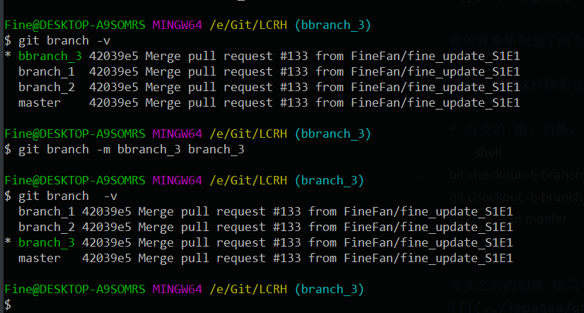

* 分支的 删：
好吧玩的差不多了，在我们进行下面的操作之前，先让我们删除我们用来练习的 branch_1  branch_2  branch_3:
```shell
git checkout master #首先切换回  master分支
git branch -d branch_1 # 删除分支 branch_1
git branch -d branch_3 # 删除分支 branch_2
git branch -d branch_2 # 删除分支 branch_3
```
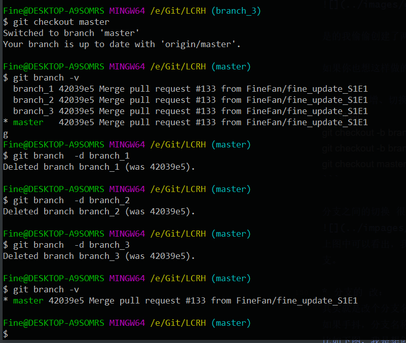

## 用户名 、 邮箱、 SSK Key 的配置
### 用户信息
之后就可以进入到该目录下面进行相关的配置和查看相关的信息了。

首先配置的是提交时候的用户名 和 邮箱，这些配置会被记录到你提交的每一个 commit当中。

```
cd LCRH
git config --local user.name "Fine Fan"
git config --local user.email "fine.fan@hotmail.com"
```
完成之后可以通过如下命令查看一下

```shell
git config --list
```


可以通过上面的图片你可以看出，我的粗手指导致的我邮箱写错了，别担心，这里是都可以进行修改的。
可以通过 修改 如下文件保存退出后完成相关的配置修改。

```shell
vim ./git/config  # 抱歉，我这里不提供vim的相关教程。
```


修改完成之后保存退出，再次使用 git config --list 可以看到我带邮箱已经被修改回来了。
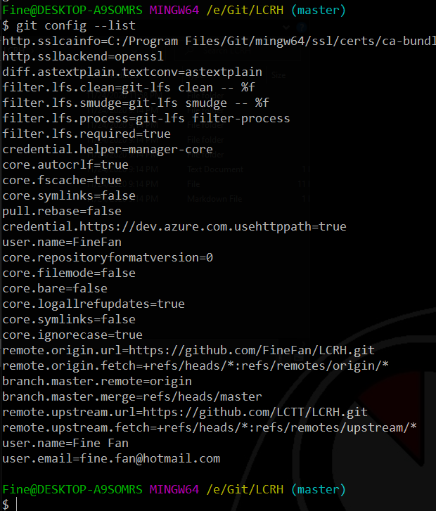


### SSH Key 配置

GPG 可进行加密及数字签名，请参考 [GitHub GPG key 帮助页面](https://help.github.com/en/articles/managing-commit-signature-verification)进行设置。

简单来说就是执行ssh-keygen之后一通回车，然后吧 ~/.ssh/id_rsa.pub里面一大串内容复制到GitHub中的 个人设置里面的SSH Key里面就好了。这样Git Hub 就有了你的SSH公钥了。	


```shell
ssh-keygen  # 之后一通回车 （严格来说其实人家有好多设置的，这为了新手方便就一通回车了。）
cat ~/.ssh/id_rsa.pub 
```
之后就可以把里面的字符串 复制到github上面的个人设置里面了


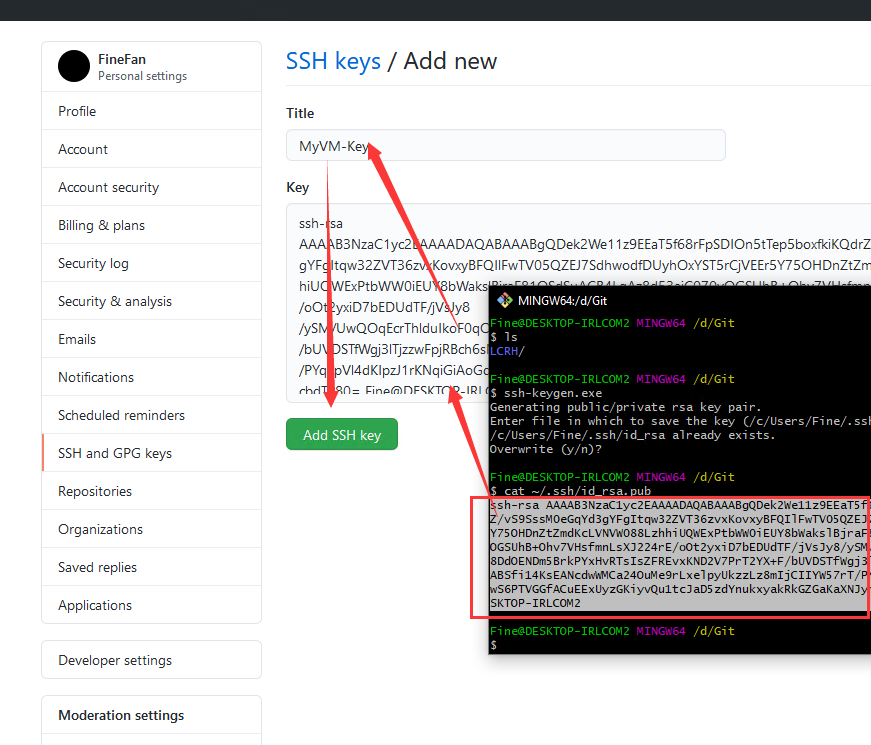

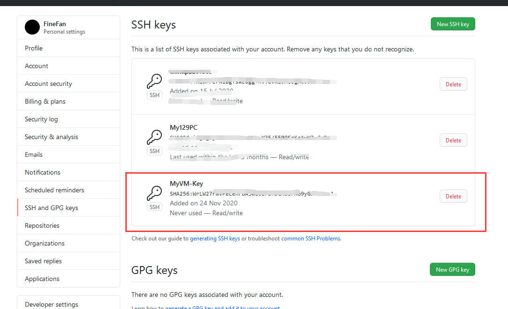


## 要开始翻译了

接下来就开始尝试写一些的翻译了.首先创建自己的分支
进入到LCRH 目录后，使用下面的命令完成创建一个名叫 fine_test_translate的分支。
```shel
git checkout -b fine_test_translate
```
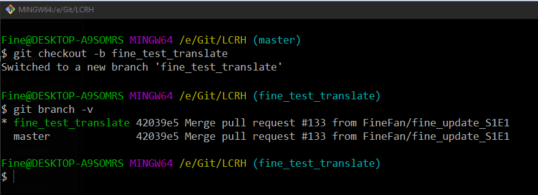

然后打开你要翻译的文件。对其进行修改，完成之后，保存退出。

此时使用git status 能够看到 git看到你对某个文件做了修改了。但是你还没有提交到git记录中。

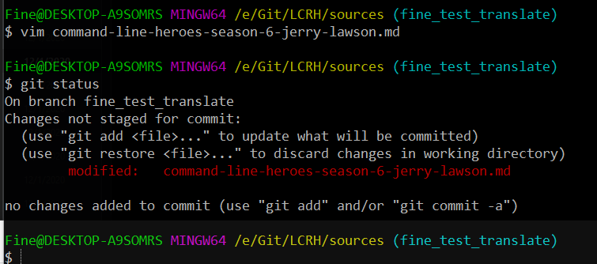

之后可以执行下面的命令来讲对应的修改提交到本地的git记录里面
```shell
git add <你修改的文件>
git commit -m "对你的修改做出一个简略的介绍"
```


完成之后就可以使用下面的命令将更新好的分支，提交到我们 Fork过来的库里面了

```shell
git push -u origin fine_test_translate
```
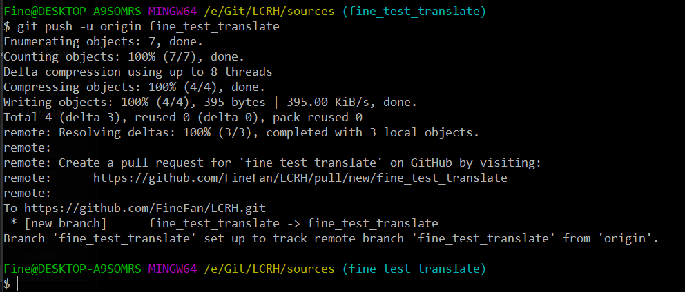

此时再次登录上游仓库的Git页面 ，点击Pull requests，之后就能够看到页面上会提示你更新了一个分支，此时点击  "Compare & pull request"便可以开始提交 PR。

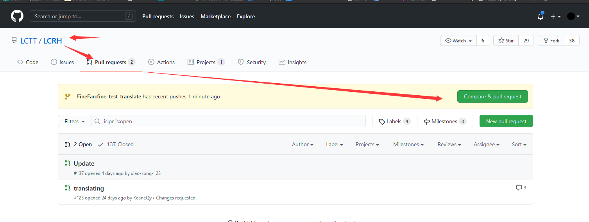

进来之后会看到如下的页面
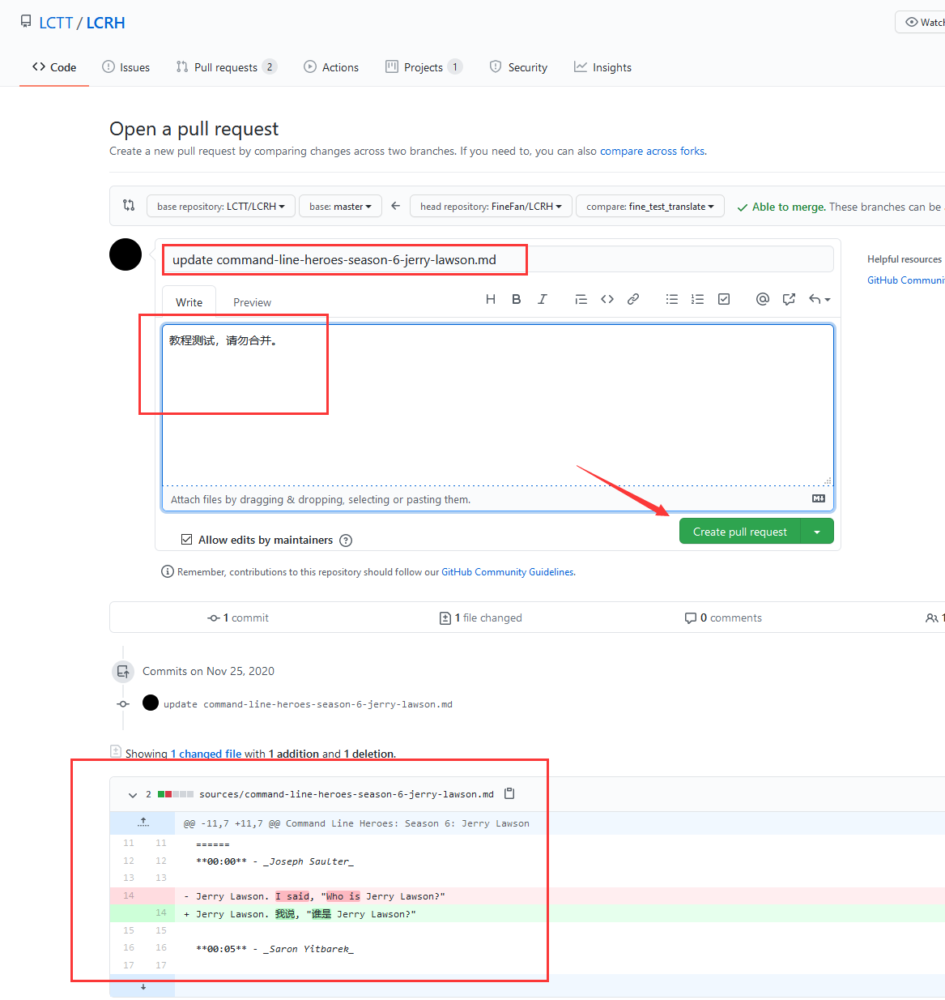
检查最下方的代码对比，之后简单写上你都修改了什么，然后点击 Create pull request即可完成一个PR的创建。之后等待审核人员前来审核即可。
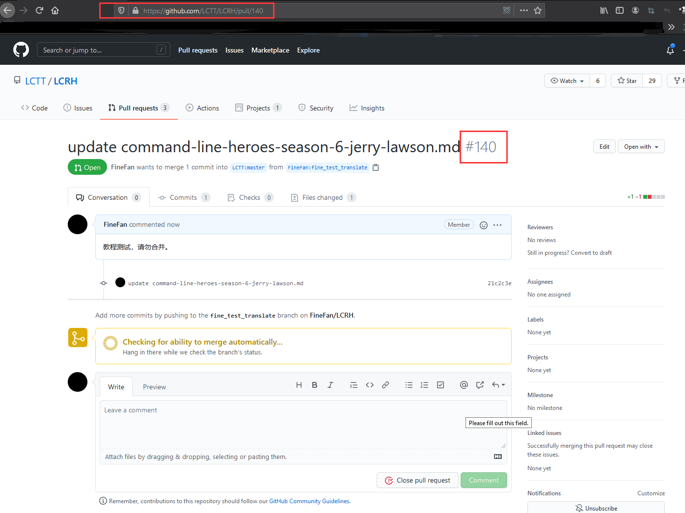
针对每一个PR 都会生成一个唯一的ID 例如上图中的#140.
如果着急的话，可以直接复制对应的URL到QQ群里面 @群主


## 如何和主库同步

首先确认你的 remote 里面添加了 upstream的内容。
之后将分支切换到 master分支
然后执行下面的代码
```shell
git remote -v
git checkout master
git fetch upstream   # 将upstream的内容抓取到本地
git merge upstream/master  # 将抓取到的master分支 合并到当前分支
git push    #之后将和并之后的代码更新到库中。
```

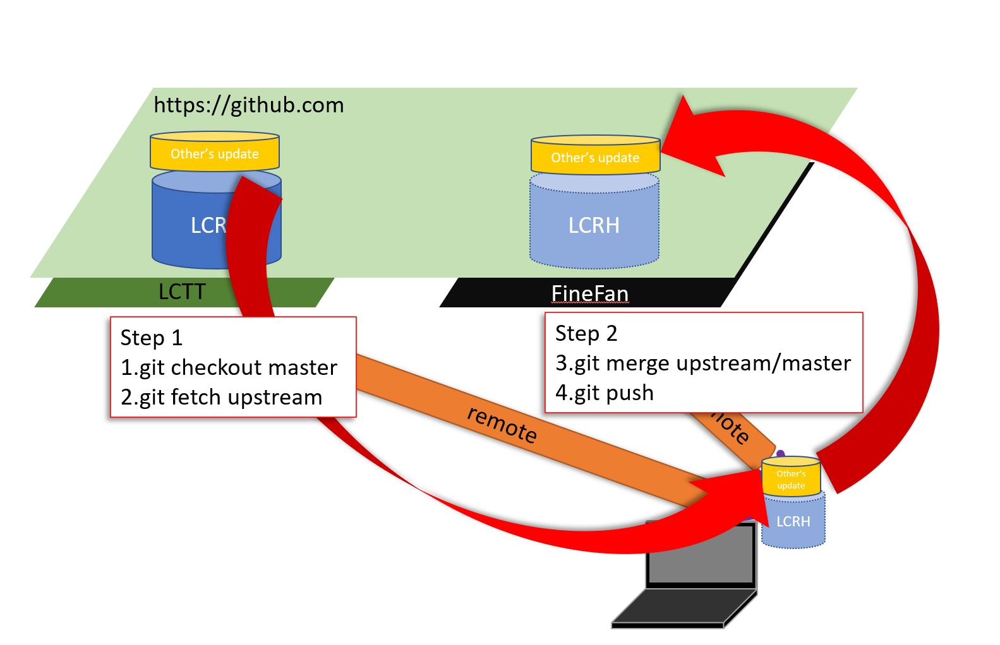


# 本人能力有限
本人能力有限，文章写的难免有所纰漏，如有发现，望不吝赐教。
Fine Fan
QQ:854413218
E-mail: fine.fan@hotmail.com